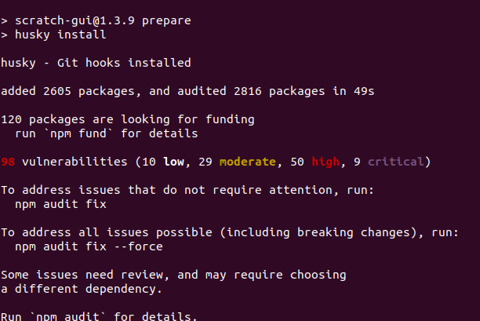
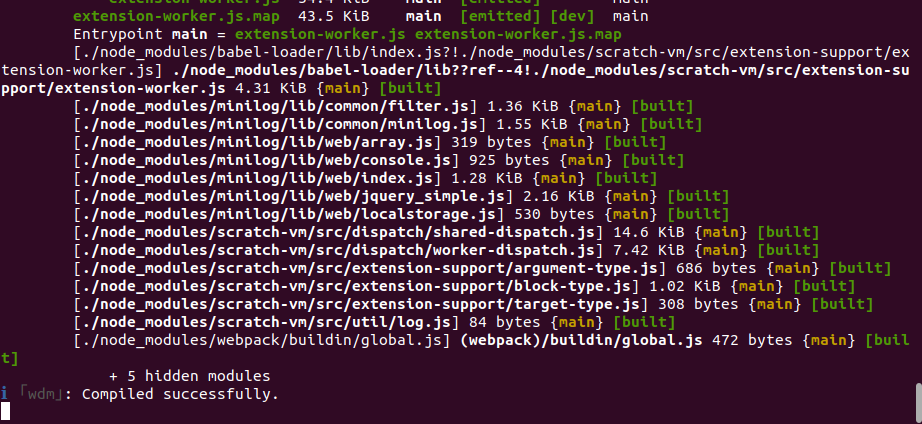
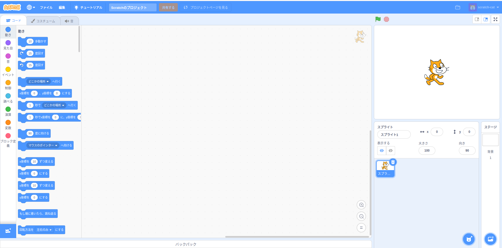

# Scratch-guiを試す https://github.com/LLK/scratch-gui#scratch-gui
## node.js npm update troubleshooting (ubuntu 20.04)
1. npm does not support Node.js v10.19.0(update node.js by download node package from site): https://github.com/nodejs/help/issues/3644#issuecomment-991971902
2. error:0308010C:digital envelope routines::unsupported: https://github.com/ant-design/ant-design-pro/issues/9272#issuecomment-1047441395
## Installation

## Running
 
running at port 8601 
